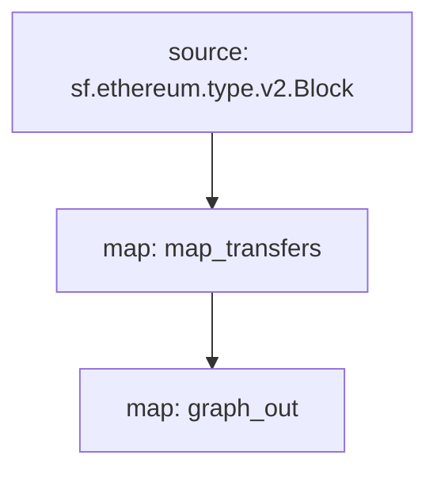

# ERC-20 Substreams

> Substreams for ERC-20 tokens.

## Quickstart

```
$ gh repo clone pinax-network/substreams-erc20-transfers
$ cd substreams-erc20
$ make
$ make gui
```

## Releases

- https://github.com/pinax-network/substreams-erc20-transfers/releases

## References

- [Ethereum Docs: ERC-20 Token Standard](https://ethereum.org/en/developers/docs/standards/tokens/erc-20/)
- [EIPS: ERC-20 Token Standard ](https://eips.ethereum.org/EIPS/eip-20)
- [OpenZeppelin implementation](https://github.com/OpenZeppelin/openzeppelin-contracts/blob/9b3710465583284b8c4c5d2245749246bb2e0094/contracts/token/ERC20/ERC20.sol)
- [ConsenSys implementation](https://github.com/ConsenSys/Tokens/blob/fdf687c69d998266a95f15216b1955a4965a0a6d/contracts/eip20/EIP20.sol)

### Events

| Event                                                          | Description                                                               |
| -------------------------------------------------------------- | ------------------------------------------------------------------------- |
| [`Transfer`](https://eips.ethereum.org/EIPS/eip-20#transfer-1) | MUST trigger when tokens are transferred, including zero value transfers. |

### Mermaid Graph



Here is a quick link to see the graph:

https://mermaid.live/edit#pako:eJx0js9qwzAMh1_F6Jyast3c2-gbbLc6FGErTVn9B1kalJB3HySQEUaP-vHx6ZsglEjg4MZYR_N1PvlsTMJ6FcbcBuJ2SVjdfuoXqg2WZCQmTVaelezPm_14lPB9aUU5kHtN9OZw8Ho8vtNevHiXlGtRWT9vZ_-_7U-zUSefoYNEnPAewcHkQUZK5MF5iDSgPsTDDB2gSvl85gBOWKkDrRGFzne8MaZ1nH8DAAD__-8lZkw

### Modules

```yaml
Package name: erc20Transfers
Version: v0.3.0
Doc: ERC-20
Modules:
----
Name: map_transfers
Initial block: 0
Kind: map
Output Type: proto:erc20.types.v1.Block
Hash: 6a9df0f0181a7785783c9441124b941baee5b6dc
Doc: Extracts 'Transfer' events from the block

Name: graph_out
Initial block: 0
Kind: map
Output Type: proto:sf.substreams.sink.entity.v1.EntityChanges
Hash: 97fe61163e78adb6c120ae2b63183a060e116635

```
