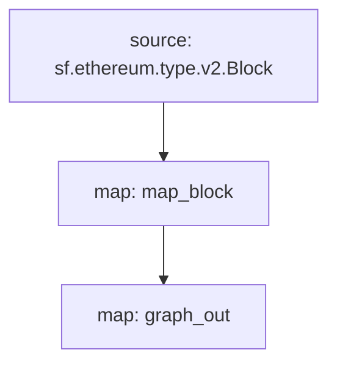

# ERC-20 Substreams

> Substreams for ERC-20 tokens.

## Quickstart

```
$ gh repo clone pinax-network/substreams-erc20-transfers-approuvals
$ cd substreams-erc20
$ make
$ make gui
```

## Releases

- https://github.com/pinax-network/substreams-erc20-transfers-approuvals/releases

## References

- [Ethereum Docs: ERC-20 Token Standard](https://ethereum.org/en/developers/docs/standards/tokens/erc-20/)
- [EIPS: ERC-20 Token Standard ](https://eips.ethereum.org/EIPS/eip-20)
- [OpenZeppelin implementation](https://github.com/OpenZeppelin/openzeppelin-contracts/blob/9b3710465583284b8c4c5d2245749246bb2e0094/contracts/token/ERC20/ERC20.sol)
- [ConsenSys implementation](https://github.com/ConsenSys/Tokens/blob/fdf687c69d998266a95f15216b1955a4965a0a6d/contracts/eip20/EIP20.sol)

### Events

| Event                                                          | Description                                                                         |
| -------------------------------------------------------------- | ----------------------------------------------------------------------------------- |
| [`Transfer`](https://eips.ethereum.org/EIPS/eip-20#transfer-1) | MUST trigger when tokens are transferred, including zero value transfers.           |
| [`Approval`](https://eips.ethereum.org/EIPS/eip-20#approval)   | MUST trigger on any successful call to `approve(address _spender, uint256 _value)`. |

### Mermaid Graph



Here is a quick link to see the graph:

https://mermaid.live/edit#pako:eJx0js1qhTAQhV8lzNobLu0u7opv0O4akWky_lBjQpwpiPjuhQhKF12emW_ONzu46AkMDBnTqD6a2i5KBUzd1xzd92fAZO7Ylu3aa-KRMknQvCXSPy_6rdBrlOzI_E-06vGw8ny-0l1aOou-i8Kn8Yrt33_u84uo7QIVBMoBJw8Gdgs8UiALxoKnHmVmCwdUgMLxfVscGM5CFUjyyNRMOGQM5_D4DQAA__-g018Y

### Modules

```yaml
Package name: erc20TransfersApprovals
Version: v0.3.0
Doc: ERC-20
Modules:
----
Name: map_block
Initial block: 0
Kind: map
Output Type: proto:erc20.types.v1.Block
Hash: d2e09cd303cbcba7596ecb53736b823f480e6450
Doc: Extracts 'Approval' & 'Transfer' events from the block

Name: graph_out
Initial block: 0
Kind: map
Output Type: proto:sf.substreams.sink.entity.v1.EntityChanges
Hash: dfa0756e058e1b7c7832879744a108acdd911720

```
